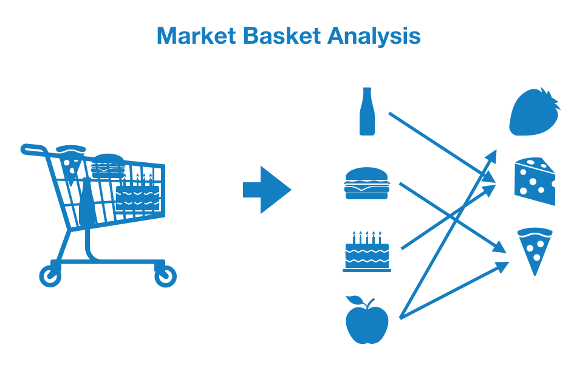
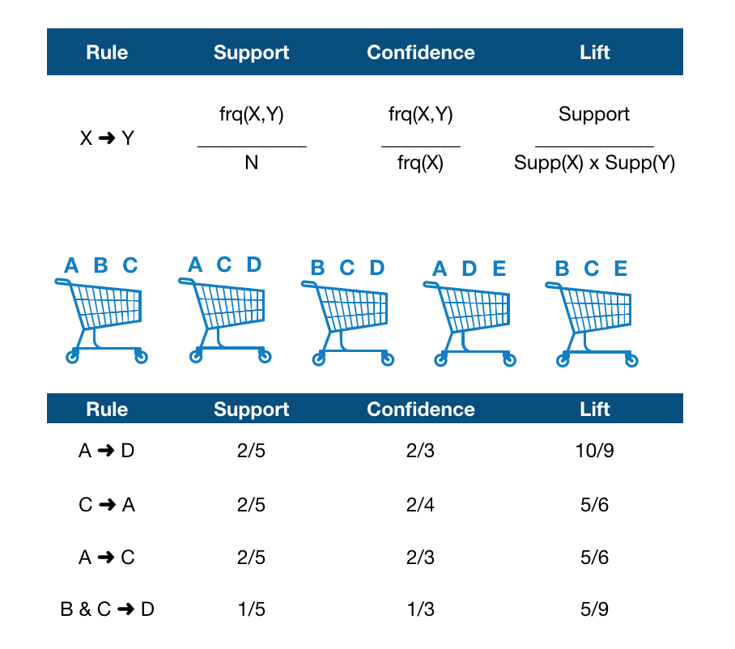

# Association-rules-cheatsheet
This is a cheatsheet for creating association rules based on frequent patterns (apriori).

## Main Features
- Data preparation
- Identify frequent itemsets with apriori algorithm
- Create association rules based on the frequent itemsets

## Dataset
-  shoppingcarts from a store

## Setup
Install mlxtend library from anaconda prompt 
- https://anaconda.org/conda-forge/mlxtend

# What are Association Rules?


## Problem to solve:
- "What do my customers buy?"
- "Which products are bought together?"

## Goal:
- Find <strong> associations </strong> and <strong>correlations</strong> between the different items that customers place in their shopping basket

## Key figures example:


```
Support(B) = (Transactions containing (B))/(Total Transactions)
Confidence(A→B) = (Transactions containing both (A and B))/(Transactions containing A)
Lift(A→B) = (Confidence (A→B))/(Support (B))
```